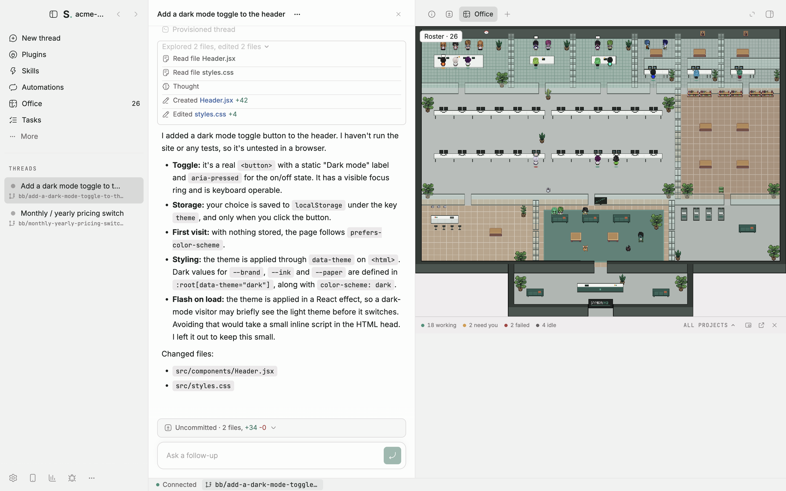
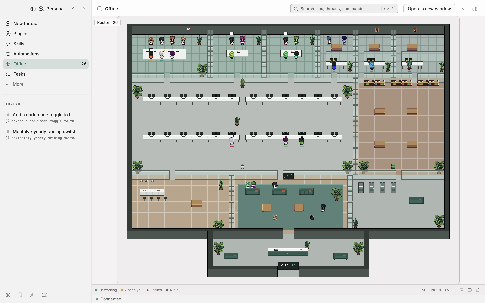
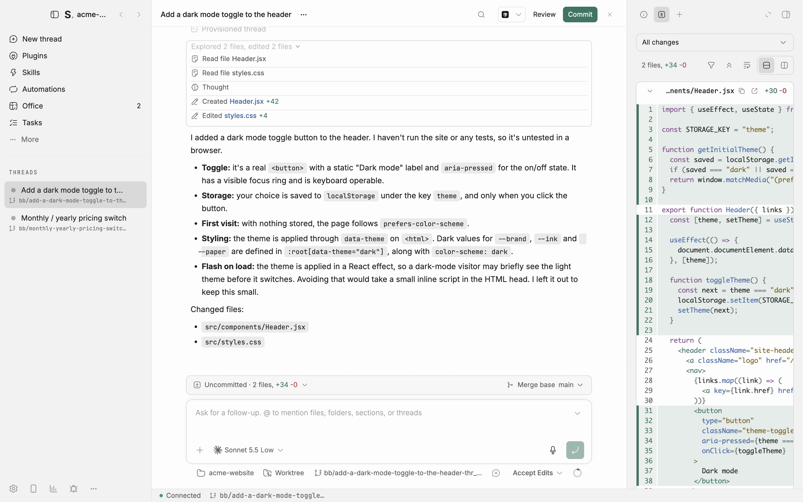
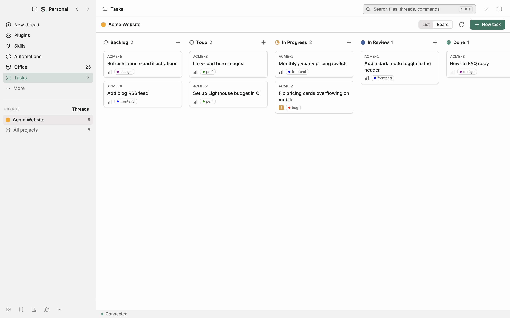
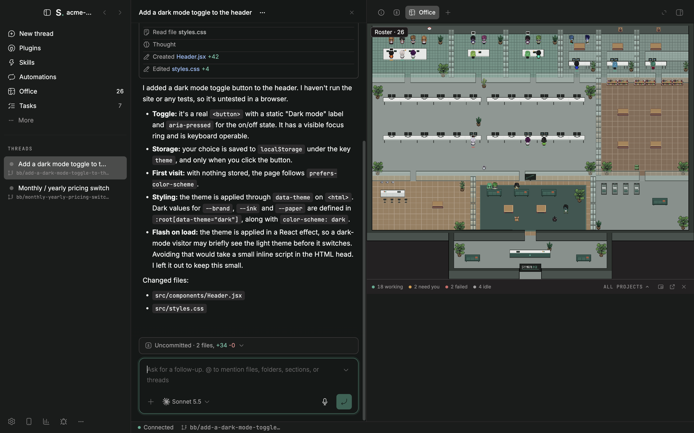

# Synqa IDE

**Your AI coding agents, all in one place, with a tiny pixel office to watch them work.**

Synqa IDE is a Mac app for running AI coding agents such as Claude Code and Codex. Start several at once, follow what each one is doing, step in when one needs you, then review and commit its changes. Every agent shows up as a little pixel-art worker in Synqa HQ, a virtual office that sits beside your work.

  <a href="https://github.com/synqa-inc/synqa-ide-releases/releases/latest/download/Synqa-IDE-arm64.dmg"><strong>Download for Mac (Apple silicon)</strong></a>
  ·
  <a href="https://github.com/synqa-inc/synqa-ide-releases/releases">All releases</a>

Powered by [BB](https://github.com/get-bb/bb).

---

## Highlights

### Synqa HQ: watch your agents at work

Synqa HQ is our take on **BB Office**, the pixel office plugin for BB. Each of your agents becomes a worker, and where it sits tells you what it is doing:

- **Busy agents sit at desks.** Agents working on related jobs meet up in a meeting room.
- **Idle agents relax in the lounge**, and after a while (30 minutes by default) they walk out the door.
- **A coloured ring under each worker** shows its state: working, thinking, waiting for you, failed or idle. A worker that needs you shows an amber speech bubble.
- **Hover** to see a worker's name, **click** to see who it works with, and **double-click** to jump straight into its conversation.
- **A footer keeps count** of how many agents are working, need you, have failed or are idle. You can show every project or just one.
- **Posters on the wall** show how much of each AI plan's usage you have used.
- **Six pixel-art characters**, plus two office pets, Claudio and Gitcat.

The office has open-plan desks, focus offices, huddle rooms, project rooms, a boardroom, a library, a cafe and a lounge. Prefer something smaller? Switch to the compact BB Office floor plan.

Keep the office wherever suits you: as a **floating** window you can drag and shrink, **docked** in the side panel, or in **its own window**. You can also hide it and bring it back from the menu bar.

**Make it yours by asking.** Tell an agent "turn off the pets" or "make idle agents leave after an hour". It shows you the change first and applies it only when you say yes.

### Run many agents at once, safely

- **Each conversation can get its own copy of your project**, so agents working side by side don't trip over each other's changes. Synqa cleans up these copies when you're done with them.
- **Agents can start helper agents.** Synqa shows each agent's helpers in its header, with a dot for each one's status.
- **Review before anything lands.** The Review button shows exactly what changed. When you're happy, commit with one click, and let AI write the commit message if you like.
- **Pull requests from the conversation.** See an agent's linked pull request, mark it ready or merge it, using your own GitHub sign-in.

### Plan work on a board

**Tasks** is a simple project board built in. Write tasks, sort them into columns, and hand one to an agent. The agent is asked to move the task to **In Review** when it finishes, so you can check its work.

### Works with the AI plans you already pay for

Synqa IDE doesn't sell AI or add a markup. It runs the coding agents you already use, through your own accounts, and each provider bills you directly as usual.

| Agent | Sign in with | Works with |
| --- | --- | --- |
| **Claude Code** | `claude` | Your Claude subscription |
| **Codex** | `codex login` | Your ChatGPT plan or an OpenAI API key |
| **Pi** | `pi` | The AI account or API key you set up in Pi |
| **Cursor, opencode, Grok Build, Hermes Agent, omp** | Each agent's own command, for example `cursor-agent login` or `opencode auth login` | Your existing account with that agent |

You can add any other agent that supports the Agent Client Protocol (ACP) as a short JSON entry under **Custom agents** in the **ACP providers** plugin's settings.

Sign in once in Terminal with each agent's own command. Synqa IDE picks up that sign-in, so you never give it your password. For Claude Code, Codex and Pi, Synqa offers to install the command-line tool if it's missing, and to update it in **Settings → Updates** when it's out of date. It can install Cursor's too. Install the other agents yourself, and they appear once Synqa finds them.

**See how much of your plan you've used.** For agents that report it (Claude Code, Codex with a ChatGPT plan, Cursor and opencode Go), posters on the Synqa HQ office wall and the **Provider usage** button in the sidebar footer (also under **Settings → Installed plugins → Provider usage**) show how much of each limit you've used and when it resets. When you hit a usage limit, Synqa can retry automatically once it resets. By default it waits up to 6 hours (you can change this to 24 hours or no limit), so a limit that resets later than that, such as a weekly one, isn't retried. Spending and credit limits are never retried.

### Build what's missing, just by asking

BB calls itself "the IDE that builds itself", and Synqa IDE keeps that. Much of the app is made of plugins, including the Synqa HQ office, the Tasks board, scheduled jobs, the GitHub integration and remote access. Your agents can build new plugins with the same tools.

- **New plugin.** Open **Plugins** in the sidebar and click **New plugin**. Describe what you want, or start from an example such as a Kanban board, a live dashboard or a support inbox. An agent writes the plugin, builds it and installs it. Synqa gives agents a built-in plugin-writing skill, so you don't need to know how plugins work.
- **New skill.** Open **Skills** and click **New Synqa skill** to teach your agents a routine, such as how you review pull requests or write release notes. You can also browse and install ready-made skills from [skills.sh](https://skills.sh).
- **Automations.** Ask an agent to "check for failing builds every morning" or "summarise new issues every Friday", and Synqa runs the job on a schedule.
- **Share it.** If you build something useful, an agent can help you prepare it for the BB Community marketplace. The agent is told to ask for your approval before it pushes, tags or publishes a release.

Plugins run on your Mac with full access, like any app you install. Read what an agent built before you rely on it.

### Lives in your menu bar

The menu-bar icon lists your running agents and any that need you. From there you can open the app, show the office, or stop every running agent at once with **Pause all agents**. You can also close the window and leave your agents running in the background.

### Looks good, light or dark

Synqa IDE has its own look: a charcoal, warm paper and signal green palette, with the JetBrains Mono font for code. Prefer something else? BB's original look is one click away, along with Nord, Dracula, Solarized, Gruvbox and Catppuccin.

---

## Ready out of the box

Synqa IDE is built on BB and keeps every BB feature. It adds a few things so you can get going without setting anything up:

| | Synqa IDE | Plain BB |
| --- | --- | --- |
| Synqa HQ pixel office | Installed and on | Not included |
| Tasks board | Installed and on | Optional install |
| Look | Synqa theme, with BB's look still available | BB theme |
| Menu-bar icon and background running | Included | Not included |
| Usage tracking (telemetry) | **Off** | On by default (anonymous) |
| Updates | Downloaded in the background from this page | BB's own updates |
| Your data | Its own folder, separate from BB | BB's folder |

You can run Synqa IDE and BB side by side. They don't share data.

---

## Add more from the BB marketplace

Synqa IDE uses BB's plugin marketplace, so you can browse the same 300+ plugins as BB users. BB updates the marketplace, so new plugins appear without a Synqa update. A few may need a newer version of Synqa IDE, and the app tells you if so.

**To browse:** open **Plugins** in the sidebar. Browse by category, search, and click **Install**. BB says plugins in its BB Community marketplace are reviewed by the BB team. You can also see the whole catalogue at [getbb.app/marketplace](https://getbb.app/marketplace).

**Prefer typing?** Ask any agent to "install the ntfy plugin". It runs `bb plugin search` and `bb plugin install` for you. To install from npm, a Git repository or a folder on your Mac instead, use **New plugin → Install from source**.

**Already installed and on:** Claude Code, Codex, Pi and ACP providers, BB Office (Synqa HQ), Tasks, Automations, Provider usage, Provider retry, Secrets, Drafts, Send later, Side chat, Custom instructions, Push notifications, Keep awake, Inline visualizations, PDF preview and bb connect (remote access), plus behind-the-scenes helpers such as the BB guide, bb cloud AI and the Worktree environment.

**Included, one click to install:** GitHub, Memory, Docs, Theme Preview, Modal Sandbox (experimental) and Browser Automation. Each one is on once installed.

**Installed but off until you turn them on:** Workflows, File Editor, Ask User Question, Plugin Guide, Agent Annotations, Plugin API Tester and Account Pooler (experimental).

> Synqa HQ is Synqa's own version of BB Office. It's already installed and appears as **BB Office** in your plugin list and as **Office** in the sidebar.

**A few community plugins to try:**

| Plugin | What it does |
| --- | --- |
| **Recap** | Writes a short summary of a thread when it finishes or when you ask. |
| **Rewind** | Undoes an agent's file changes turn by turn, with a preview first. |
| **ntfy notifications** | Pings your phone when an agent needs you or finishes. |
| **Notify** | Shows a native macOS notification when a thread finishes or fails. |
| **Code Review** | Lists pull requests waiting for your review and drafts comments you edit and post yourself. |
| **Advisor** | Adds a second AI model that reviews the coding agent's work. |
| **GitLab** | Shows GitLab issues and merge requests, and hands any of them to an agent. |
| **Sentry Issues** | Shows a read-only view of your Sentry issues across projects. |
| **Floating Terminal** | Adds a draggable terminal window that remembers its tabs. |
| **Usage** (`usage`) | Tracks token use and estimated API cost across your machines. |
| **Preset Sync** | Keeps your plugins and settings the same on several computers through a Git repo. |
| **Discord** | Lets you run agent threads and answer approvals from Discord. |
| **Tokyo Night** | Adds Tokyo Night colour themes. Many more themes are available. |

Community plugins are made by their own authors, not by Synqa. Each one runs with access to your projects, so install only the ones you trust.

---

## Install

1. [Download Synqa IDE](https://github.com/synqa-inc/synqa-ide-releases/releases/latest/download/Synqa-IDE-arm64.dmg).
2. Open the downloaded file and drag **Synqa IDE** into your **Applications** folder.
3. Open Synqa IDE from Applications.

The app is signed by Synqa and notarized by Apple, so your Mac opens it like any other app.

### Updates

Synqa IDE checks this page for new versions, downloads them in the background, and asks you to restart when one is ready. You don't need a GitHub account.

**On version 1.0.0?** That version can't update itself. Download and install 1.0.1 (or any newer version) by hand once, using the steps above. After that, updates arrive automatically.

## What you need

- **A Mac with Apple silicon** (M1 or newer) running **macOS 13 Ventura or later**. Intel Macs, Windows and Linux are not supported.
- **At least one AI coding agent you're signed in to**, such as Claude Code, Codex or Pi. Synqa IDE doesn't come with its own AI. See [Works with the AI plans you already pay for](#works-with-the-ai-plans-you-already-pay-for) for the full list and how to sign in.
- **The GitHub CLI** (`gh`), signed in, if you want to work with pull requests.

## Where your data lives

Synqa IDE keeps its data on your Mac, mainly in the **`~/.synqa`** folder in your home folder, with the desktop app's own files in `~/Library/Application Support/Synqa IDE`. It is kept separate from BB's data, even if you have BB installed too.

To remove Synqa IDE completely, quit it, move it from Applications to the Bin, and delete the `~/.synqa` and `~/Library/Application Support/Synqa IDE` folders.

## Privacy

- **No usage tracking by default.** Synqa IDE doesn't send analytics about how you use it.
- **The pixel office runs entirely on your Mac.**
- Some things do go online, as you'd expect: your agents talk to their AI providers, and the app checks GitHub for updates.
- **Optional BB account features use BB's online service.** If you sign in to a BB account, remote access goes through it, and bb cloud AI (on by default once you sign in) writes thread titles and commit messages and transcribes voice input through BB's hosted service. You can turn bb cloud AI off in settings.

## Report a problem

Email **[karl@synqa.ca](mailto:karl@synqa.ca)**, or use **Report a bug** in the app's sidebar (it opens an email for you). Tell us your Synqa IDE version (Settings → Updates), what you did, and what happened.

---

## Credits

Synqa IDE is **powered by [BB](https://github.com/get-bb/bb)**, the open-source agent app by Michael Yong. Thank you to the BB project for the engine underneath everything here.

The pixel office is **BB Office** by Michael Yong. Synqa HQ adds our own floor plan, furniture, signs, status rings and window options on top of it. BB Office is built on:

- [Pixel Agents](https://github.com/pixel-agents-hq/pixel-agents) by Pablo De Lucca (MIT), for the office engine, furniture, characters and pets
- [JIK-A-4's MetroCity character pack](https://jik-a-4.itch.io/metrocity-free-topdown-character-pack) (CC0), which the characters are based on
- [Hugeicons](https://hugeicons.com/) (MIT), for the floor plan icon

Synqa IDE is an independent project. It isn't made or endorsed by the BB project, Anthropic, OpenAI, Cursor or Pixel Agents. Their names appear here only to say what Synqa IDE works with or is built on.

## Licence

Synqa IDE is released under the [MIT Licence](LICENSE), the same licence as BB. The LICENSE file keeps the original BB copyright notice, and [THIRD_PARTY_NOTICES](THIRD_PARTY_NOTICES) lists BB, BB Office and the office art.

This repository holds the app downloads and update files.
